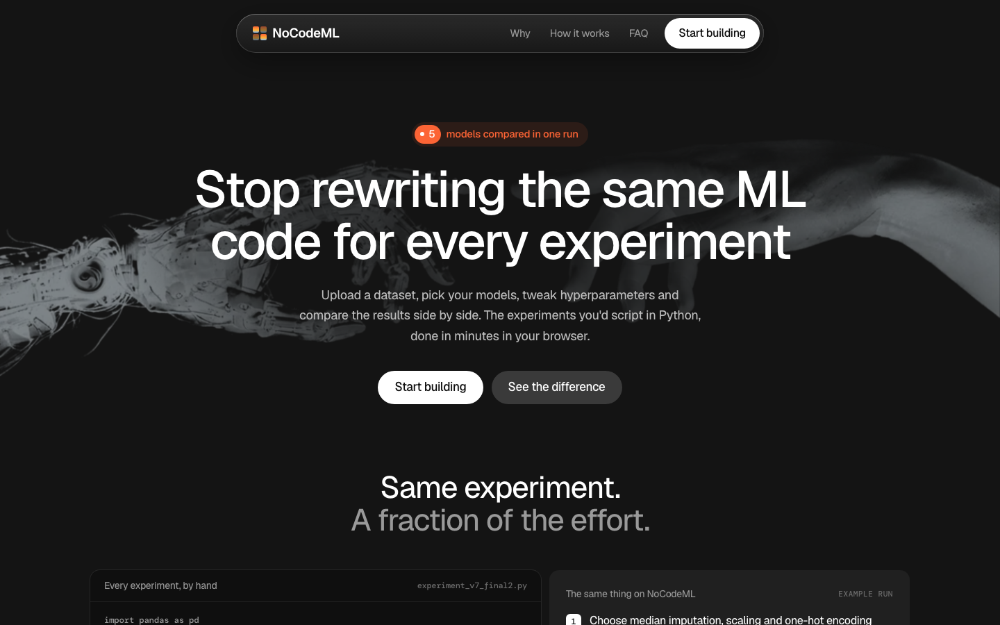
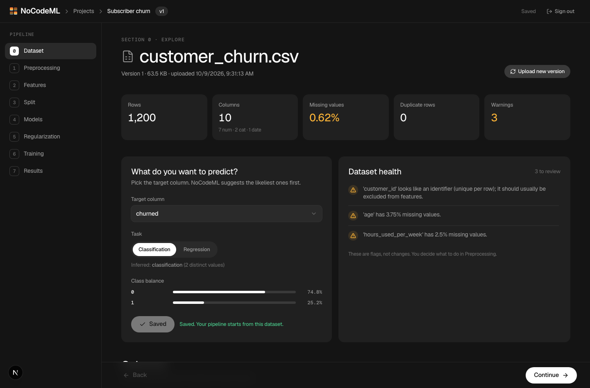
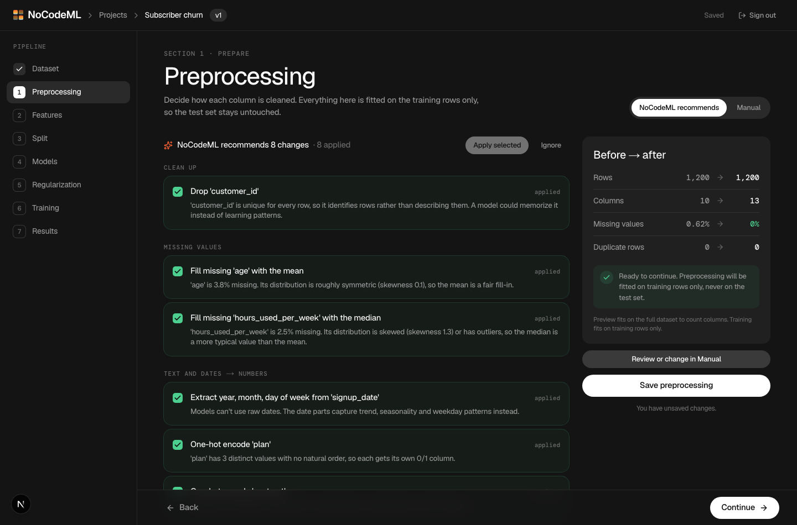
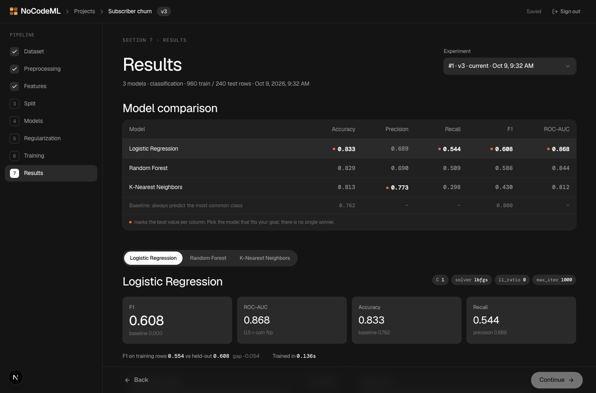
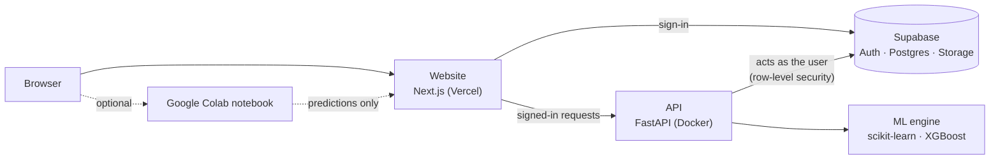

# NoCodeML

**Run, compare and tweak machine-learning experiments in your browser, without rewriting the same Python for every test.**

Upload a dataset, make each decision visually (cleaning, features, split, models, settings), train up to five models side by
side, and get honest, reproducible results with a PDF report. Built for researchers who keep copy-pasting the same pipeline code.

**Live:** https://nocodeml.vercel.app &nbsp;·&nbsp; **Status:** public beta &nbsp;·&nbsp; **License:** MIT &nbsp;·&nbsp; [Privacy](https://nocodeml.vercel.app/privacy) · [Terms](https://nocodeml.vercel.app/terms)



## What you can do

- **Bring your data:** CSV, Excel (`.xlsx`, first sheet) or Parquet. NoCodeML profiles every column and flags identifiers,
  missing values, outliers and class imbalance before you decide anything.
- **Decide step by step:** eight guided sections: dataset, preprocessing, feature engineering, split, models, regularization,
  training, results. Each has *recommended* settings with the reason for each, and a manual mode.
- **Compare models fairly:** logistic/linear/ridge/lasso regression, KNN, decision tree, random forest, gradient boosting,
  XGBoost and SVM (up to five at once), all on the same split, always shown next to a trivial baseline.
- **Tune automatically:** grid or random hyperparameter search, scored on the training rows only so your test data never
  influences the choice.
- **Trust the result:** a quality engine checks the *experiment* (not just the accuracy): leakage, overfitting, imbalance,
  tiny test sets. Every run is versioned and re-creatable from its stored configuration.
- **Get a report:** a deterministic PDF with your data, every decision, the metrics, the charts and the final configuration.
- **Train where you like:** on the NoCodeML server, or in your own **Google Colab** (see below).

| Explore your data | Preprocessing, with reasons | Compare models |
|---|---|---|
|  |  |  |

## Why the numbers can be trusted

- **No leakage by construction.** Imputers, encoders, scalers and outlier bounds are fitted on training rows only, per fold,
  inside one scikit-learn pipeline. Test rows are only ever *transformed*.
- **Deterministic.** The whole experiment is one versioned `PipelineConfig`; the same data and config give the same results.
  Changing any earlier step marks later results as outdated instead of silently reusing them.
- **No "best model" claim.** Results are shown against a baseline, and you pick the model that fits your goal.
- **Private by design.** Each user's data sits in private storage, locked to their account by database row-level security,
  not only by application code.

## Train on Google Colab (free, no server compute)

1. In NoCodeML, finish the steps before training and click **Download data bundle**. The server prepares the data
   (preprocessing learned from the training rows only) and zips per-fold CSV files plus the list of models to train.
2. Open [`web/public/nocodeml-colab.ipynb`](web/public/nocodeml-colab.ipynb) in Colab, choose **Runtime → Run all**, and upload the
   zip. The notebook is plain pandas + scikit-learn (no NoCodeML code needed) and downloads `nocodeml_results.json`.
3. Upload that file back. It contains **predictions only**. The server computes every metric, curve, baseline and quality check
   itself from those predictions and the true labels, so a score can never be typed in.

## How it fits together



- The **API never holds a master key.** It uses each signed-in user's own token, so the database's row-level security is the
  real authorization boundary.
- **Job status lives in the database** (one active training per project, heartbeat-based crash recovery, cancel), so a server
  restart can't leave a training stuck as "running".

## Repository layout

```
.
├── web/                Next.js 16 website (React 19, Tailwind v4): landing, sign-in, the 8-section workspace
├── engine/             Python package: ML engine + FastAPI API
│   ├── nocodeml_engine/   profiling, preprocessing, features, splitting, models, training, evaluation, quality,
│   │                      reports (PDF), colab bundle/import, persistence (Supabase), api
│   ├── tests/             ~195 tests (engine, API, Supabase SQL, reports, Colab round trip)
│   └── scripts/           dev scripts (demo runs, API smoke test)
├── supabase/           database migrations (schema, row-level security, hardening, training jobs)
├── examples/           small sample datasets to try
├── docs/               deploy guide, roadmap, screenshots
├── design/source/      original hero images used to make the landing page
├── Dockerfile          builds the API for any container host
└── .env.example        settings for local development
```

## Run it locally

You need **Python 3.10+**, **Node 20+**, and a free [Supabase](https://supabase.com) project. (macOS only: `brew install libomp`,
which XGBoost needs.)

**1. Database.** In your Supabase project open *SQL Editor* and run, in order, each file once:
`supabase/migrations/0001_schema.sql`, `0002_hardening.sql`, `0003_training_jobs.sql`. Enable *Email* under
*Authentication → Providers* (Google is optional).

**2. Settings.** Copy `.env.example` to `.env` at the repository root and fill in `SUPABASE_URL` and `SUPABASE_ANON_KEY`
(the **anon** key; never use the service-role key). Create `web/.env.local` with:

```
NEXT_PUBLIC_SUPABASE_URL=<same URL>
NEXT_PUBLIC_SUPABASE_ANON_KEY=<same anon key>
NEXT_PUBLIC_API_URL=http://127.0.0.1:8000
```

**3. API.**

```bash
cd engine
python3 -m venv .venv
.venv/bin/pip install -e ".[dev]"
.venv/bin/uvicorn nocodeml_engine.api.main:app --port 8000        # health check: http://127.0.0.1:8000/health
```

**4. Website.**

```bash
cd web
npm install
npm run dev                                                      # http://localhost:3000
```

Create an account, make a project and upload [`examples/customer_churn.csv`](examples/customer_churn.csv).

**Tests and checks**

```bash
cd engine && .venv/bin/pytest            # engine, API, reports, Colab round trip (SQL tests need local Postgres binaries)
cd web && npx tsc --noEmit && npm run lint
```

## Deploying

The API ships as a Docker image (`Dockerfile`) and the website deploys to Vercel. [`docs/deploy.md`](docs/deploy.md) has the
settings for production mode, a hardening checklist, and how to run on a free host (Render free plan: 512 MB RAM, so uploads
are capped at 10 MB there).

## Roadmap and docs

- [`docs/roadmap.md`](docs/roadmap.md): what is done, what is next, and the backlog
- [`docs/deploy.md`](docs/deploy.md): going live
- [`supabase/README.md`](supabase/README.md): what the database enforces
- [`engine/README.md`](engine/README.md) · [`web/README.md`](web/README.md): working on each part

## Security and privacy

Please report vulnerabilities privately to **nocodemachinelearning@gmail.com** rather than opening a public issue.
How data is handled is described in the [Privacy Policy](https://nocodeml.vercel.app/privacy).

## License

[MIT](LICENSE) © 2026 Vishwaswarup Rath. You are free to use, copy, modify and distribute the code, including commercially,
as long as the copyright notice and licence text are kept. The software is provided as is, without warranty.
Contributions are welcome: open an issue first for anything sizeable.
